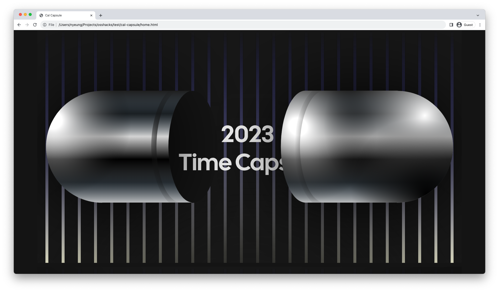

# cal-capsule


Cal Capsule is you and your team's year-end breakdown of their Cal bookings ala Spotify Unwrapped. There's some cool animations too.

### Tech Stack
Vanilla JS, CSS, HTML, a few libraries. This was mostly a front-end exercise into animation libraries and a simple Flask Backend to generate data approximating querying the prisma database in the main cal.com repo and then doing analysis on it.

## To Run Demo

### Backend
The backend api is modeled after the queries for cal.ai insights. To start the server, first use your python env manager of choice.

`conda create -n python=3.9`

Then, install the requirements file with

`pip install -r requirements .txt`

Finally, set `FLASK_APP="app.py"` and then the server can start with

`flask run`.

To see the endpoint for a user, navigate to `http://127.0.0.1:5000/timecapsule?name={some_name}`. For example, 

`http://127.0.0.1:5000/timecapsule?name=Bailey}` yields the following data:

```{"Individual Stats":{"individual_average_meeting_hours":0.7767857142857143,"individual_longest_meeting":{"event_name":"Product Design","hours":1.5},"individual_shortest_meeting":{"event_name":"Product Sales","hours":0.25},"individual_total_meeting_hours":21.75,"individual_total_meetings":28,"most_met_with":"Keith"},"Team Stats":{"meeting_day_distribution":{"Friday":58,"Monday":68,"Saturday":56,"Sunday":42,"Thursday":51,"Tuesday":79,"Wednesday":40},"most_common_meeting_day":"Tuesday","team_avg_meeting_hours":0.833756345177665,"team_total_meeting_hours":328.5,"team_total_meetings":394}}```

### Frontend
After the server is started, simple open up the `home.html` with your browser, and you should be able to see the 2023 Cal Capsule!

### Future Work
Integrate directly into the `cal.com` insights feature. 